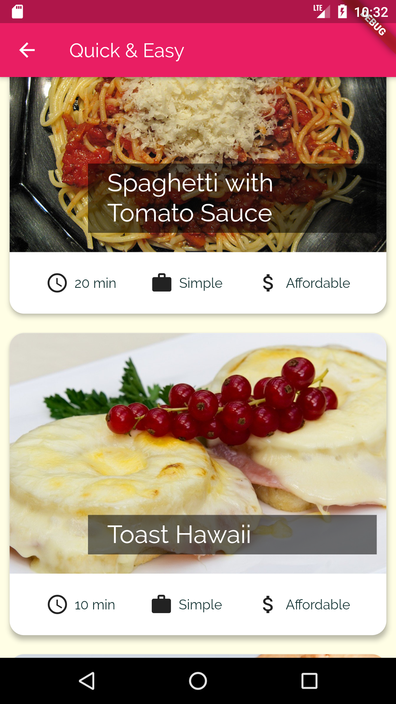
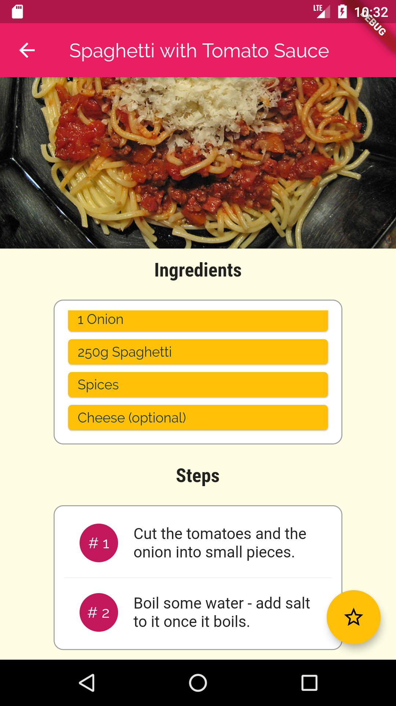

# MEALS APP

A Meals App Using Flutter.

## Screenshots





### How to use

* Clone the repo:
```
git clone https://github.com/anubhavvs/mealsApp.git
```
* Move to the project folder
```
cd mealsApp
```
* Run the flutter App after connecting to a Android Emulator
```
flutter run
```
